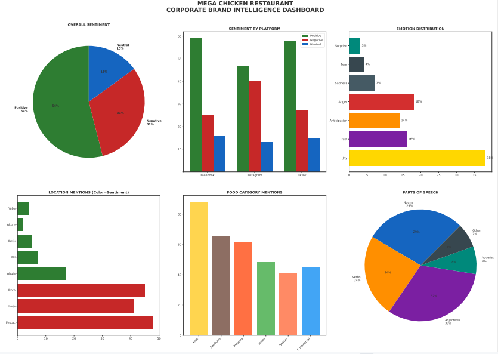

## 🐔 Mega Chicken Social Media Sentiment Analysis

An AI-powered sentiment analysis project that explores customer feedback on Mega Chicken Restaurant using Natural Language Processing (NLP), data analysis, and interactive visualisations to uncover actionable business insights.

## 📖 Project Overview

Understanding customer perception is essential for business growth. This project analyses social media comments relating to Mega Chicken Restaurant to identify customer sentiment, recurring themes, and behavioural patterns.

The project combines Artificial Intelligence, data analysis, and data visualisation to transform unstructured customer feedback into meaningful insights that can support strategic business decisions.

---

## 🎯 Objectives

- Analyse customer sentiment from social media comments.
- Classify comments into Positive, Neutral, and Negative sentiments.
- Identify common customer concerns and strengths.
- Visualise insights through charts and dashboards.
- Demonstrate practical applications of AI in business analytics.

---

## 🛠️ Technologies Used

- Python
- Jupyter Notebook (Anaconda)
- Pandas
- Matplotlib
- Artificial Intelligence
- Microsoft Excel

## 📂 Repository Structure

mega-chicken-sentiment-analysis
│
├── code
│   └── mega-chicken-sm-analysis.ipynb
│
├── images
│   └── dashboard-preview.png
│
├── prompts
│   └── prompts.txt
│
├── report
│   ├── mega-chicken-sm-analysis.docx
│   ├── mega-chicken-sm-report.odt
│   ├── mega-chicken-sm-comments.xlsx
│   └── mega-chicken-sm-sentiment-dashboard.pdf
│
└── README.md

## 📊 Dashboard Preview

## 📄 Project Report

The complete analysis and findings are available in the **report** folder:

- Full Project Report (.docx)
- OpenDocument Report (.odt)
- Dashboard (.pdf)
- Source Dataset (.xlsx)

## 💡 Key Insights

The analysis revealed:

- Overall customer sentiment distribution.
- Frequently discussed food categories.
- Most mentioned restaurant locations.
- Common positive and negative experiences.
- Actionable recommendations for improving customer satisfaction.

## 🤖 AI Workflow

This project demonstrates how Artificial Intelligence can support business intelligence by transforming unstructured customer opinions into measurable insights.

## 🧠 Prompt Engineering

The prompts used to guide the AI models throughout this project have been included in the `prompts` folder to demonstrate the prompt engineering process behind the analysis and dashboard generation.

## 👩🏽‍💻 Author

**Immaculate Ileagu**

AI • Full-Stack Development • Data Analysis • Digital Storytelling

Portfolio:  https://immaculateinana.github.io/VIBE_ENGINEERED_PERSONAL_PORTFOLIO/

Blog: https://immaculateinana.github.io/LETS_GROW/

LinkedIn: www.linkedin.com/in/immaculate-ileagu-5a883522a

⭐ If you found this project interesting, consider giving it a star.
